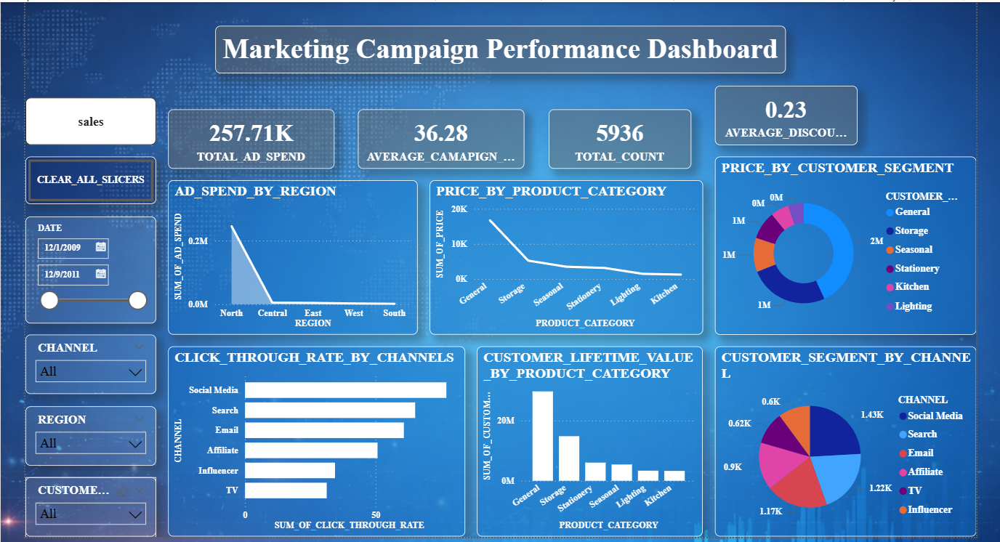
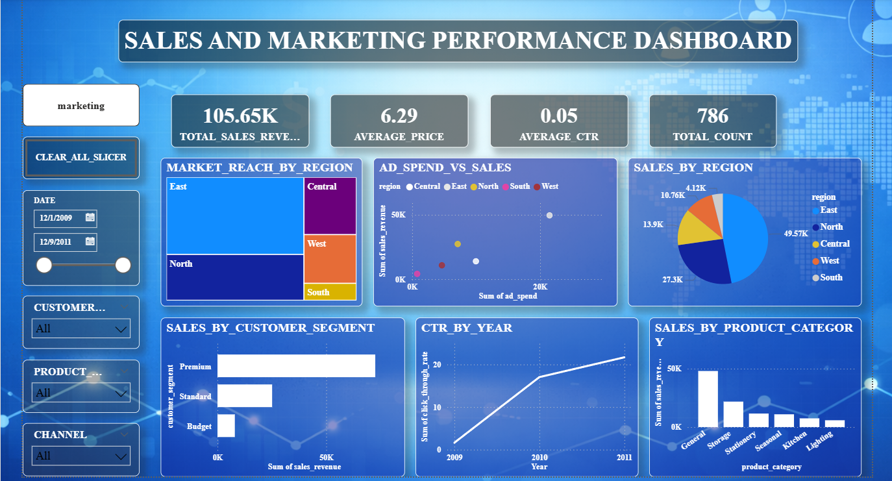

<h1 align="center"> Marketing & Sales Analytics Dashboard (Power BI)</h1>

  <b>End-to-End Business Analytics Project | Power BI | Excel | Data Analytics</b>

  This project showcases interactive dashboards designed to analyze marketing campaigns, customer behavior, and sales performance using real-world business metrics.

<h2> Project Objective</h2>

To analyze and visualize marketing and sales data in order to uncover actionable insights that support data-driven decision-making. 
The dashboards focus on evaluating campaign effectiveness, optimizing channel performance, and understanding customer segments.

<h2> Dashboards Overview</h2>

<h3>1️. Marketing Campaign Performance Dashboard</h3>

<ul>
  <li> Total Ad Spend & Campaign Efficiency</li>
  <li> Click-Through Rate (CTR) by Marketing Channels</li>
  <li> Regional Ad Spend Distribution</li>
  <li> Product Category Pricing Analysis</li>
  <li> Customer Lifetime Value (CLV)</li>
</ul>

<h3>2️. Sales & Marketing Performance Dashboard</h3>

<ul>
  <li> Total Sales Revenue & KPI Tracking</li>
  <li> Sales Distribution by Region</li>
  <li> Ad Spend vs Sales Correlation</li>
  <li> Customer Segment Analysis</li>
  <li> Year-wise CTR Trends</li>
</ul>

<h2> Tools & Technologies</h2>
<ul>
  <li> <b>Power BI</b> – Interactive dashboards, DAX measures, data modeling</li>
  <li> <b>Microsoft Excel</b> – Data cleaning and structured dataset preparation</li>
  <li> <b>Data Visualization</b> – Charts, KPIs, and storytelling techniques</li>
  <li> <b>Business Analytics</b> – Insight generation and performance analysis</li>
</ul>

<h2> Dataset Description</h2>

The dataset contains key business and marketing variables:

<ul>
  <li>Region, Channel, Product Category</li>
  <li>Customer Segment</li>
  <li>Ad Spend, Impressions</li>
  <li>Click-Through Rate (CTR)</li>
  <li>Sales Revenue</li>
  <li>Customer Lifetime Value (CLV)</li>
</ul>

<h2> Key Insights</h2>
<ul>
  <li> High ad spend does not always result in higher sales, indicating optimization opportunities</li>
  <li> Social Media and Search channels drive higher engagement (CTR)</li>
  <li> Certain product categories contribute significantly to customer lifetime value</li>
  <li> Regional performance differences highlight targeted marketing opportunities</li>
  <li> Customer segmentation helps identify high-value customer groups</li>
</ul>

<h2> Key Features</h2>
<ul>
  <li> Interactive slicers (Region, Channel, Customer Segment, Date)</li>
  <li> Dynamic KPI cards for quick insights</li>
  <li> Drill-down and filtering capabilities</li>
  <li> Clean and user-friendly dashboard design</li>
</ul>

<h2> How to Use</h2>
<ol>
  <li>Download the <b>.pbix</b> file from this repository</li>
  <li>Open using <b>Power BI Desktop</b></li>
  <li>Interact with filters and slicers to explore insights</li>
</ol>

<h2> Project Structure</h2>
<pre>
Marketing & Sales Analytics Dashboard (Power BI)
│── marketing_sales_dashboard.pbix
│── Dataset
│   ├── train.csv
│   ├── test.csv
│── Images
│   ├── marketing_campaign_performance_dashboard.png
│   ├── sales_and_marketing_performance_dashboard.png
│── README.md
</pre>

<h2> About Me</h2>

<b>Anjana C</b> 
Aspiring Data Analyst | Power BI • Excel • Data Visualization 

   If you found this project useful, consider giving it a star!

